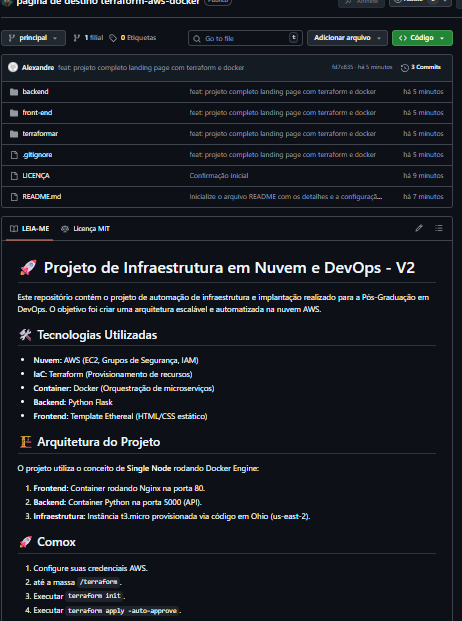
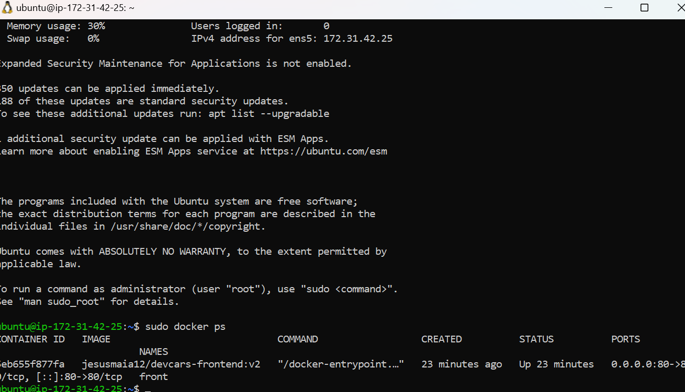
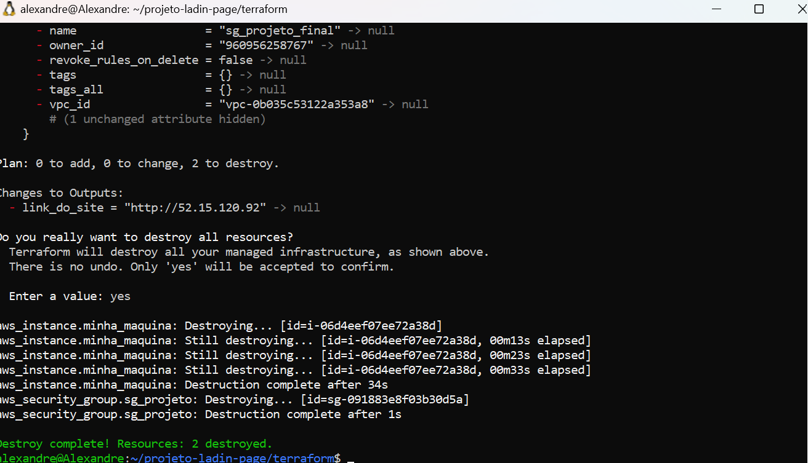

# 🏗️ Projeto DevOps: Deploy Multicontainer na AWS com Terraform e Docker

Este projeto demonstra a criação, o provisionamento e a implantação de uma aplicação web baseada em containers na nuvem da AWS, utilizando conceitos práticos de Infraestrutura como Código (IaC) e isolamento de ambientes.

A aplicação foi estruturada em duas camadas:
* **Frontend:** Páginas estáticas servidas de forma performática pelo Nginx.
* **Backend:** API desenvolvida em Python com o framework Flask.
* **Infraestrutura:** Provisionamento automatizado via Terraform na AWS.

---

## 📸 Evidências do Projeto Funcionando

### 1. Interface da Aplicação Web e Navegação (Frontend)
O site interativo renderizado perfeitamente no navegador do usuário, comunicando-se de forma estável através do IP público da EC2:



#### 🎥 Vídeo de Demonstração Completa
Acompanhe no player abaixo a fluidez do layout, as seções e o formulário do template funcionando:

<video src="images/video1_Mo5Fpxyi.mp4" width="100%" controls></video>

### 2. Infraestrutura Provisionada e Ativa na AWS
Validação das instâncias e recursos criados via código direto pelo painel de controle da Amazon Web Services:


### 3. Validação do Servidor e Ambiente Docker
Acesso ao terminal Ubuntu Server via SSH, demonstrando o gerenciamento e a saúde dos containers criados:



---

## 🛠️ Stack Tecnológica

* **Nuvem (Cloud):** Amazon Web Services (AWS EC2, VPC, Security Groups, IAM)
* **Infraestrutura como Código:** Terraform
* **Containerização:** Docker
* **Backend API:** Python (Flask)
* **Frontend / Servidor Web:** HTML5 / CSS3 / Nginx

---

## 📐 Arquitetura do Ambiente

* **Modelo:** *Single Node* (Ambiente dedicado para estudo, validação de arquitetura e laboratório).
* **Servidor:** 1 Instância EC2 rodando Docker Engine.
* **Portas de Comunicação:**
  * **Porta 80 (HTTP):** Frontend exposto para a internet via Nginx.
  * **Porta 5000:** Backend em Flask rodando isolado no ambiente interno.

---

## ⚙️ Processo de Deploy e Estratégia de Infraestrutura

Para consolidar o aprendizado dos conceitos fundamentais de redes e containers na nuvem, optei por realizar um **deploy estratégico manual**, construindo o ambiente do zero diretamente na máquina virtual sem o uso inicial de registries externos (como o Amazon ECR).

### 🔧 Etapas do Fluxo:
1. Provisionamento automatizado de toda a rede e computação usando comandos do **Terraform**.
2. Autenticação e acesso seguro à instância Linux via **SSH**.
3. *Build* das imagens Docker (Frontend e Backend) construídas diretamente dentro do ambiente da VM.
4. Inicialização e orquestração manual dos containers na porta `80`.

### 💥 Destruição Controlada do Ambiente
Garantindo o controle de custos e ciclo de vida limpo da infraestrutura (IaC), a remoção de todos os recursos é feita de forma automatizada pelo terminal:



---

## 🧠 Aprendizados Relevantes

* **Entendimento Sem Abstrações:** Compreensão profunda do ciclo de deploy tradicional, sem mascarar processos através de ferramentas automáticas.
* **Contexto de Build do Docker:** Resolução de problemas práticos de escopo e caminhos de arquivos (`COPY` de artefatos no Dockerfile).
* **Ciclo de Vida de Infraestrutura:** Gestão rigorosa de estados de recursos na nuvem com Terraform.

---

## ⚠️ Limitações Atuais & Próximos Passos

A atual estrutura foi desenhada com foco educacional, apresentando oportunidades de evolução que serão implementadas nas próximas fases:

* [ ] **Automação de CI/CD:** Implementar esteiras de automação com o GitHub Actions.
* [ ] **Registry Centralizado:** Migrar o armazenamento e versionamento das imagens Docker para o Amazon ECR.
* [ ] **Escalabilidade:** Evoluir a arquitetura de *Single Node* para um ambiente com alta disponibilidade.

---

## ▶️ Como Executar o Laboratório

1. **Provisionar a Infraestrutura:**
   ```bash
   cd terraform
   terraform init
   terraform apply -auto-approve
